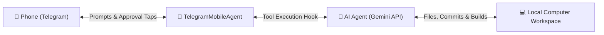

# 📱 TelegramMobileAgent

> **Prompt, build, and orchestrate desktop AI coding agents directly from your phone via Telegram — with smart permission guardrails and live desktop synchronization.**

[](LICENSE)
[](https://www.python.org/)
[](https://core.telegram.org/bots/api)
[](https://ai.google.dev/)

---

## 🌟 Overview

**TelegramMobileAgent** creates a private, secure bridge between your mobile Telegram app and an autonomous AI coding agent running on your computer.

Whether you're taking a walk, commuting, or lying in bed, you can prompt your desktop to build features, create mobile apps, run unit tests, or manage codebases. All generated code and modifications update directly on your computer's local disk in real time.



---

## ✨ Key Features

- 📱 **Mobile-First Development**: Send natural language prompts from Telegram to build apps, edit components, and run scripts on your computer.
- 📋 **Summary-First Protocol**: The agent always streams an initial structured plan to your phone *before* touching code or running tools.
- 🛡️ **Smart Risk-Based Permission Gating**:
  - Safe operations (creating files, code edits, package installs, running tests) execute autonomously without spamming you.
  - **Destructive operations** (e.g., `rm -rf`, `rmdir /s`, `del /f`, `git reset --hard`, database drops) automatically pause and send an interactive Telegram card with **`[✅ Approve]`** and **`[❌ Reject]`** buttons.
- 🔁 **Instant `/retry`**: Easily re-run your previous prompt with one tap if you hit API rate limits or connection glitches.
- 🔒 **Zero-Trust User ID Lockdown**: The bot strictly ignores messages from any Telegram user except your designated numeric User ID.
- 💸 **0-Cost Local Utility Commands**: Administrative commands (`/help`, `/status`, `/reset`, `/workspace`, `/mode`) run 100% locally on your PC and consume **zero API tokens**.
- 📂 **Dynamic Workspace Switching**: Switch active project folders on your computer remotely via `/workspace <path>`.

---

## 📋 Prerequisites

1. **Python 3.10+** installed on your computer.
2. A **Telegram account** (free).
3. A **Google Gemini API Key** (available free from [Google AI Studio](https://aistudio.google.com/app/api-keys)).

---

## 🚀 Quick Start Guide

### 1. Clone the Repository

```bash
git clone https://github.com/JettyYippy/TelegramMobileAgent.git
cd TelegramMobileAgent
```

### 2. Create and Configure `.env`

Copy the example configuration file:

```bash
# On Linux/macOS
cp .env.example .env

# On Windows (PowerShell)
copy .env.example .env
```

Open `.env` and configure your credentials:

```env
# 1. Telegram Bot Token from @BotFather
TELEGRAM_BOT_TOKEN=123456789:ABCdefGhIJKlmNoPQRsTUVwxyZ

# 2. Your Telegram User ID from @userinfobot (restricts bot access to you)
TELEGRAM_ALLOWED_USER_ID=987654321

# 3. Google Gemini API Key from Google AI Studio
GEMINI_API_KEY=AIzaSy...your_gemini_api_key

# 4. Target folder where the agent builds code (defaults to ./workspace)
DEFAULT_WORKSPACE=./workspace
```

#### How to get your credentials:
* **`TELEGRAM_BOT_TOKEN`**: Open Telegram, chat with [@BotFather](https://t.me/botfather), type `/newbot`, and follow the steps.
* **`TELEGRAM_ALLOWED_USER_ID`**: Chat with [@userinfobot](https://t.me/userinfobot) on Telegram to get your personal numerical ID.
* **`GEMINI_API_KEY`**: Get a free API key at [Google AI Studio](https://aistudio.google.com/app/api-keys).

---

### 3. Install Dependencies & Launch

#### Windows (One-Click)
Double-click `run.bat` (or execute `.\run.ps1` in PowerShell).

#### Linux / macOS / Manual Setup
```bash
# Create virtual environment
python3 -m venv .venv

# Activate environment
source .venv/bin/activate  # On Windows: .venv\Scripts\activate

# Install dependencies
pip install -r requirements.txt

# Start the bridge
python bot.py
```

---

## 📱 Mobile Command Reference

All administrative commands run locally on your machine and consume **0 Gemini API tokens**:

| Command | Description | Token Cost |
| :--- | :--- | :--- |
| `/start` | Connect and verify bot status | Free (0 tokens) |
| `/model` or `/models` | View available models, descriptions, and RPM limits | Free (0 tokens) |
| `/model <id>` | Switch active model on the fly (e.g. `/model 2.5-flash`) | Free (0 tokens) |
| `/status` | View agent state (`Idle`/`Working`), active model, and workspace | Free (0 tokens) |
| `/retry` | Re-executes your previous prompt | Only execution turn |
| `/reset` | Resets agent state if stuck and clears pending approvals | Free (0 tokens) |
| `/workspace <path>` | Views or switches the active project directory | Free (0 tokens) |
| `/mode [high_risk\|safe\|strict]` | Adjusts permission sensitivity | Free (0 tokens) |
| `/help` | Displays command reference guide | Free (0 tokens) |

---

## ⚡ Supported Models & Rate Limits (RPM)

Because autonomous coding agents make multiple tool calls in quick succession (each tool call is 1 request), choosing the right model for your workload is essential:

| Model ID | Short Alias | Free Tier RPM | Paid Tier RPM | Best For |
| :--- | :--- | :--- | :--- | :--- |
| **`gemini-2.5-flash`** ⭐ | `flash`, `2.5` | **15 RPM** | **1,000+ RPM** | **Default Daily Driver** — Fast, high capacity, rare rate limits. |
| **`gemini-1.5-flash`** | `1.5`, `1.5-flash` | **15 RPM** | **1,000+ RPM** | Lightweight, rock-solid stable tasks. |
| **`gemini-2.5-pro`** | `pro`, `2.5-pro` | **2 RPM** | **360+ RPM** | Deep reasoning & multi-file architectural planning. |
| **`gemini-3.7-flash`** | `3.7`, `3.7-flash` | **5 RPM** | **1,000+ RPM** | Hybrid reasoning agent workloads. |
| **`gemini-3.8-flash`** | `3.8`, `3.8-flash` | **5 RPM** | **1,000+ RPM** | Latest experimental features and previews. |

> [!TIP]
> **Free Tier Tip**: By default, **`gemini-2.5-flash`** is configured because it provides **15 Requests/Min** on the Free Tier (3x more than preview models).
> If you hit a rate limit (HTTP 429), the bot's built-in `retry_config` will automatically back off and retry, or you can simply send `/retry` after ~45 seconds!
> To unlock **1,000+ RPM** and eliminate waiting entirely, enable Pay-As-You-Go in [Google AI Studio](https://aistudio.google.com/) (Flash models typically cost <$0.05 for a whole day of coding).

---

## 🛡️ Review Sensitivity Modes

Switch modes on the fly using `/mode`:

- **`high_risk` (Default & Recommended)**: Only destructive operations like `rm -rf` or file wipes halt for button approval. Normal coding and safe commands proceed autonomously.
- **`safe`**: Asks for approval on all modifying actions (any shell command or file write).
- **`strict`**: Asks for approval on every single tool execution (including file reads).

---

## 🧪 Running Tests

To verify the test suite and risk analyzer:

```bash
python -m unittest tests/test_bridge.py
```

---

## 🔒 Security & Privacy

- **Never commit `.env`**: Your `.env` file contains secret credentials and is included in `.gitignore`.
- **User Authentication**: Only messages originating from `TELEGRAM_ALLOWED_USER_ID` are processed. All other users receive an immediate `403 Access Denied`.
- **Local-First Execution**: The bot runs directly on your machine. No third-party servers intermediary your communication other than the official Telegram Bot API and Google Gemini API.

---

## 🤝 Contributing

Contributions, issues, and feature requests are welcome! Feel free to check the [issues page](https://github.com/JettyYippy/TelegramMobileAgent/issues).

---

## 📄 License

This project is licensed under the [MIT License](LICENSE).
