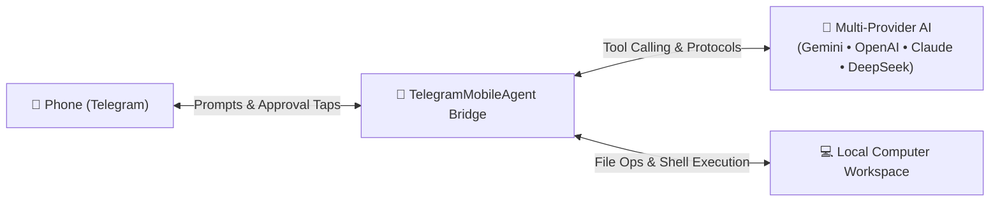

# 📱 TelegramMobileAgent

> **Prompt, build, and orchestrate desktop AI coding agents directly from your phone via Telegram — with multi-provider AI support, smart permission guardrails, and live desktop synchronization.**

[](LICENSE)
[](https://www.python.org/)
[](https://core.telegram.org/bots/api)
[](https://ai.google.dev/)
[](https://platform.openai.com/)
[](https://console.anthropic.com/)
[](https://platform.deepseek.com/)

---

## 🌟 Overview

**TelegramMobileAgent** turns your mobile phone into a portable command center for autonomous AI software engineering. It connects your phone via Telegram to an AI coding agent running locally on your computer.

Whether you're taking a walk, commuting, or away from your desk, you can prompt your machine to build features, create applications, write unit tests, or run terminal commands. All changes and code execute directly on your computer's local disk in real time.



---

## ✨ Key Features

- 📱 **Mobile-First Remote Coding**: Prompt your computer from your phone to write code, install libraries, debug errors, and run tests.
- ⌨️ **Instant Command Dropdown Menu**: Typing `/` or tapping the Telegram `[/]` menu button opens an auto-complete dropdown drawer showing all commands and descriptions.
- 🌐 **Multi-Provider AI Freedom**: Switch effortlessly between the world's best models on the fly:
  - **Google Gemini** (`gemini-3.6-flash`, `gemini-3.5-flash`, `gemini-2.5-pro`, `gemini-3.7-flash`)
  - **OpenAI** (`gpt-4o`, `gpt-4o-mini`, `o3-mini`, `o1`)
  - **Anthropic Claude** (`claude-3-7-sonnet`, `claude-3-5-sonnet`, `claude-3-5-haiku`)
  - **DeepSeek** (`deepseek-chat` / V3, `deepseek-reasoner` / R1)
  - **xAI Grok** (`grok-2-latest`)
- 📋 **Summary-First Protocol**: The agent always outputs a concise 2-4 bullet plan to your phone *before* touching code or running tools.
- 🛡️ **Smart Risk-Based Permission Gating**:
  - Safe operations (creating files, code edits, running unit tests) execute automatically.
  - **Destructive operations** (e.g., `rm -rf`, `rmdir /s`, `del /f`, `git reset --hard`, database drops) pause and send interactive Telegram cards with **`[✅ Approve]`** and **`[❌ Reject]`** buttons.
- 🔁 **Instant `/retry`**: Quickly re-run your previous prompt with one tap if you hit transient API rate limits.
- 🔒 **Zero-Trust Lockdown**: The bot strictly ignores messages from anyone except your personal Telegram User ID.
- 💸 **0-Cost Administrative Commands**: Local commands (`/model`, `/models`, `/status`, `/reset`, `/workspace`, `/mode`, `/help`) run on your PC and consume **zero tokens**.
- 📂 **Dynamic Workspace Switching**: Switch active project directories on your computer remotely via `/workspace <path>`.

---

## ⚡ Supported Models & Rate Limits (RPM)

Because autonomous coding agents make multiple tool calls in quick succession (each step is 1 API request), choosing the right model for your workload and quota is essential:

| Provider | Model ID | Short Alias | Free Tier RPM | Paid Tier RPM | Best For |
| :--- | :--- | :--- | :--- | :--- | :--- |
| **Google** | **`gemini-3.6-flash`** ⭐ | `3.6`, `flash`, `3.6-flash` | **15 RPM** | **1,000+ RPM** | **Default Daily Driver** — Fast, smart, high capacity, fully verified. |
| **Google** | **`gemini-3.5-flash`** | `3.5`, `3.5-flash` | **15 RPM** | **1,000+ RPM** | High-speed, rock-solid stable tasks. |
| **Google** | **`gemini-flash-latest`** | `latest`, `flash-latest` | **15 RPM** | **1,000+ RPM** | Points dynamically to latest stable Flash release. |
| **Google** | **`gemini-2.5-pro`** | `pro`, `2.5-pro` | **2 RPM** | **360+ RPM** | Deep reasoning & multi-file architectural planning. |
| **Google** | **`gemini-3.7-flash`** | `3.7`, `3.7-flash` | **5 RPM** | **1,000+ RPM** | Hybrid reasoning agent workloads. |
| **OpenAI** | **`gpt-4o`** | `4o`, `gpt4o` | *Paid Only* | **500 - 10,000 RPM** | Flagship multimodal intelligence & general coding. |
| **OpenAI** | **`gpt-4o-mini`** | `4o-mini`, `mini` | *Paid Only* | **500 - 10,000 RPM** | Ultra-fast & cost-effective daily driver. |
| **OpenAI** | **`o3-mini`** | `o3`, `o3-mini` | *Paid Only* | **500 - 5,000 RPM** | STEM, complex algorithms & logic reasoning. |
| **OpenAI** | **`o1`** | `o1` | *Paid Only* | **500 - 1,000 RPM** | Premier deep-thinking & architecture design. |
| **Anthropic** | **`claude-3-7-sonnet`** | `claude-3.7`, `sonnet-3.7` | *Paid Only* | **1,000 - 4,000 RPM** | SOTA coding flagship with hybrid reasoning. |
| **Anthropic** | **`claude-3-5-sonnet`** | `claude-3.5`, `sonnet` | *Paid Only* | **1,000 - 4,000 RPM** | Industry gold standard for autonomous agents. |
| **Anthropic** | **`claude-3-5-haiku`** | `haiku` | *Paid Only* | **1,000 - 4,000 RPM** | Ultra-fast execution & rapid responsiveness. |
| **DeepSeek** | **`deepseek-chat`** | `deepseek`, `v3` | *Pay-as-you-go* | **60 - 600+ RPM** | 671B MoE model, top-tier coding at ultra-low cost. |
| **DeepSeek** | **`deepseek-reasoner`** | `r1`, `deepseek-r1` | *Pay-as-you-go* | **60 - 600+ RPM** | Open reasoning model rivaling OpenAI o1. |
| **xAI** | **`grok-2-latest`** | `grok`, `grok-2` | *Paid Only* | **600+ RPM** | Frontier LLM with real-time reasoning. |

> [!TIP]
> **Free Tier Tip**: By default, **`gemini-3.6-flash`** is configured because it provides **15 Requests/Min on Google's Free Tier** (no credit card required).
> If you hit a rate limit (HTTP 429), the bot automatically performs exponential backoff retries, or you can send `/retry` after ~45 seconds.


---

## 🚀 Quick Start Guide

### 1. Clone the Repository

```bash
git clone https://github.com/JettyYippy/TelegramMobileAgent.git
cd TelegramMobileAgent
```

### 2. Create and Configure `.env`

Copy the template configuration file:

```bash
# On Windows (PowerShell)
copy .env.example .env

# On Linux / macOS
cp .env.example .env
```

Open `.env` and fill in your credentials. You only need to add an API key for the provider(s) you plan to use:

```env
# 1. Telegram Bot Token from @BotFather
TELEGRAM_BOT_TOKEN=123456789:ABCdefGhIJKlmNoPQRsTUVwxyZ

# 2. Your Telegram User ID from @userinfobot (restricts access to you)
TELEGRAM_ALLOWED_USER_ID=987654321

# 3. AI Provider Keys (Fill in at least ONE):
GEMINI_API_KEY=AIzaSy...your_gemini_key       # https://aistudio.google.com/app/api-keys
OPENAI_API_KEY=sk-...your_openai_key         # https://platform.openai.com/api-keys
ANTHROPIC_API_KEY=sk-ant-...your_claude_key  # https://console.anthropic.com/settings/keys
DEEPSEEK_API_KEY=sk-...your_deepseek_key     # https://platform.deepseek.com/api_keys
XAI_API_KEY=xai-...your_xai_key              # https://console.x.ai/

# 4. Target folder where the agent builds code (defaults to ./workspace)
DEFAULT_WORKSPACE=./workspace

# 5. Default Model (optional, defaults to gemini-3.6-flash)
DEFAULT_MODEL=gemini-3.6-flash
```

#### How to get your credentials:
- **`TELEGRAM_BOT_TOKEN`**: Open Telegram, message [@BotFather](https://t.me/botfather), send `/newbot`, and copy the token.
- **`TELEGRAM_ALLOWED_USER_ID`**: Send any message to [@userinfobot](https://t.me/userinfobot) on Telegram to get your numeric ID.
- **AI Keys**:
  - Google Gemini: [Google AI Studio](https://aistudio.google.com/app/api-keys) (Free tier available)
  - OpenAI: [OpenAI Platform](https://platform.openai.com/api-keys)
  - Anthropic: [Anthropic Console](https://console.anthropic.com/settings/keys)
  - DeepSeek: [DeepSeek Platform](https://platform.deepseek.com/api_keys)

---

### 3. Install Dependencies & Launch

#### Windows (One-Click)
Double-click `run.bat` (or run `.\run.ps1` in PowerShell).

#### Linux / macOS / Manual
```bash
# Create virtual environment
python3 -m venv .venv

# Activate environment
source .venv/bin/activate  # Windows: .venv\Scripts\activate

# Install dependencies
pip install -r requirements.txt

# Start the bridge
python bot.py
```

---

## 📱 Mobile Command Reference

All administrative commands run locally on your machine and consume **0 API tokens**:

| Command | Description | Token Cost |
| :--- | :--- | :--- |
| `/start` | Connect and verify bot status | Free (0 tokens) |
| `/model` or `/models` | View full catalog of models, aliases, and RPM limits | Free (0 tokens) |
| `/model <name>` | Switch active model on the fly (e.g. `/model 4o`, `/model sonnet`, `/model deepseek`, `/model flash`) | Free (0 tokens) |
| `/status` | View agent state (`Idle`/`Busy`), active model, and configured providers | Free (0 tokens) |
| `/retry` | Re-executes your previous prompt | Only execution turn |
| `/logs [keyword]` | View recent filtered diagnostic errors directly in chat | Free (0 tokens) |
| `/reset` | Resets agent state if stuck and clears pending approvals | Free (0 tokens) |
| `/workspace <path>` | Views or switches the active project directory | Free (0 tokens) |
| `/mode [high_risk\|safe\|strict]` | Adjusts permission sensitivity | Free (0 tokens) |
| `/help` | Displays command reference guide | Free (0 tokens) |

---

## 🔍 Diagnostics & Error Logs

TelegramMobileAgent maintains clean, date-filtered diagnostic error logs so you can inspect what went wrong (e.g. rate limits, network timeouts, or model errors) and modify configurations accordingly.

### Viewing Logs from Telegram Mobile
- Send `/logs` to immediately see the latest filtered errors recorded today.
- Send `/logs 429` (or `/logs 404`, `/logs timeout`) to filter today's log for specific errors.

### Viewing & Filtering Logs from Desktop CLI
A standalone CLI tool `view_logs.py` is included for desktop inspection:

```bash
# View today's filtered errors (defaults to 50 lines)
python view_logs.py

# Filter by a specific error code or keyword
python view_logs.py --keyword 429
python view_logs.py --keyword 404

# Inspect a specific date
python view_logs.py --date 2026-09-20 --lines 100
```

---

## 🛡️ Review Sensitivity Modes

Switch modes on the fly using `/mode`:

- **`high_risk` (Default & Recommended)**: Only destructive operations like `rm -rf`, `rmdir /s`, or file wipes halt for button approval. Normal coding, file creation, and safe commands proceed autonomously.
- **`safe`**: Asks for approval on all modifying actions (any shell command or file write).
- **`strict`**: Asks for approval on every single tool execution (including file reads).

---

## 🧪 Running Tests

To run the automated test suite verifying risk analysis, multi-provider model routing, and workspace sandbox boundaries:

```bash
python -m unittest discover -s tests
```

---

## 🔒 Security & Privacy

- **Never commit `.env`**: Your `.env` file contains secret credentials and is blocked by `.gitignore`.
- **User Authentication**: Only messages originating from `TELEGRAM_ALLOWED_USER_ID` are processed. All other users receive an immediate `403 Access Denied`.
- **Workspace Boundary Sandbox**: Tool execution is strictly confined to your specified workspace directory to prevent unintended modifications to your host operating system.
- **Local-First Execution**: The bridge runs directly on your machine. No third-party servers intermediary your communication other than the official Telegram Bot API and your configured AI model APIs.

---

## 🤝 Contributing

Contributions, issues, and feature requests are welcome! Feel free to check the [issues page](https://github.com/JettyYippy/TelegramMobileAgent/issues).

---

## 📄 License

This project is licensed under the [MIT License](LICENSE).
